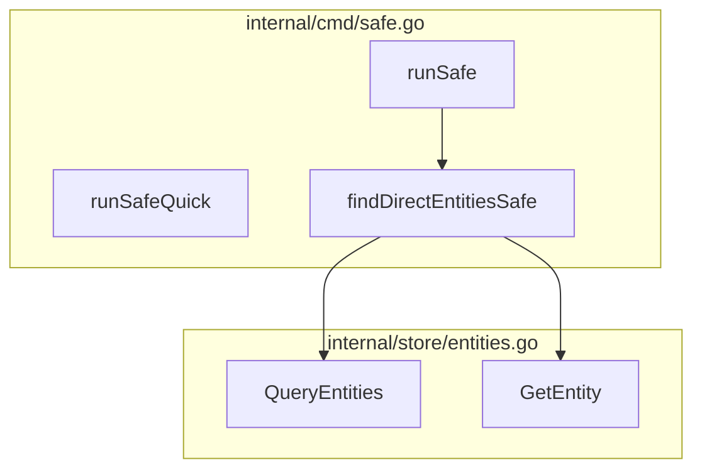

# cx graph Command Design

## Overview

The `cx graph` command generates visual dependency graphs from Cortex's code analysis data. It supports multiple output formats with D2 as the primary format due to its superior layout algorithms for software architecture diagrams.

## Command Syntax

```bash
cx graph <target> [flags]
```

### Target Types

| Target | Description | Example |
|--------|-------------|---------|
| Entity name | Graph centered on a specific function/type | `cx graph Execute` |
| File path | Graph all entities in a file | `cx graph internal/cmd/safe.go` |
| Package/directory | Graph all entities in a package | `cx graph internal/store/` |
| `--all` | Full codebase graph (use with caution) | `cx graph --all` |

### Flags

| Flag | Default | Description |
|------|---------|-------------|
| `--format` | `d2` | Output format: `d2`, `mermaid`, `dot`, `json`, `ascii` |
| `--direction` | `both` | Edge direction: `in`, `out`, `both` |
| `--depth` | `2` | Traversal depth from target |
| `--layout` | `tala` | D2 layout engine: `tala`, `elk`, `dagre` |
| `--group-by` | `file` | Grouping: `file`, `package`, `none` |
| `--edge-types` | `all` | Filter edges: `calls`, `uses_type`, `implements`, `all` |
| `--output`, `-o` | stdout | Output file path |
| `--render` | `false` | Render to image (requires D2 CLI for D2 format) |
| `--sketch` | `false` | Hand-drawn style (D2 only) |
| `--theme` | `default` | D2 theme: `default`, `dark`, `terminal` |

## Output Formats

### D2 (Primary)

D2 is the recommended format for most use cases:

- **Best layout quality** - TALA engine designed for software architecture
- **Containers** - Natural grouping by file/package
- **Multiple export options** - SVG, PNG, PDF, ASCII via D2 CLI
- **Active development** - Modern tooling with growing ecosystem

```bash
# Generate D2, render to SVG
cx graph Execute --format d2 -o graph.d2
d2 graph.d2 graph.svg

# Or render directly (requires D2 CLI)
cx graph Execute --render -o graph.svg

# ASCII output for terminal
cx graph Execute --format d2 | d2 --layout elk - - 2>/dev/null | cat
```

### Mermaid

Best for embedding in GitHub/GitLab where it renders natively:

```bash
cx graph Execute --format mermaid
```

Output can be pasted directly into Markdown:

````markdown

````

### DOT (Graphviz)

For users who prefer Graphviz or need maximum compatibility:

```bash
cx graph Execute --format dot | dot -Tpng -o graph.png
```

### JSON

Raw structured data for custom tooling:

```bash
cx graph Execute --format json | jq '.nodes | length'
```

### ASCII

Simple terminal-friendly output for quick visualization:

```bash
cx graph Execute --format ascii
```

## D2 Output Structure

### Basic Entity Graph

```d2
direction: right

# Containers group by file
internal/cmd/root.go: {
  Execute: {
    shape: rectangle
    style.fill: "#e1f5fe"
  }
}

internal/cmd/safe.go: {
  runSafe
  runSafeQuick
  findDirectEntitiesSafe
}

internal/store/entities.go: {
  QueryEntities
  GetEntity
}

# Connections with edge types
Execute -> runSafe: calls {
  style.stroke: "#1976d2"
}

runSafe -> findDirectEntitiesSafe: calls
findDirectEntitiesSafe -> QueryEntities: calls
findDirectEntitiesSafe -> GetEntity: calls
```

### Edge Type Styling

Different dependency types use distinct visual styles:

| Edge Type | Arrow | Color | Style |
|-----------|-------|-------|-------|
| `calls` | `->` | Blue (#1976d2) | Solid |
| `uses_type` | `->` | Green (#388e3c) | Dashed |
| `implements` | `->` | Purple (#7b1fa2) | Dotted, diamond head |
| `extends` | `->` | Orange (#f57c00) | Solid, triangle head |

### Node Styling by Entity Type

| Entity Type | Shape | Fill Color |
|-------------|-------|------------|
| Function | rectangle | Light blue (#e1f5fe) |
| Method | rectangle | Light cyan (#e0f7fa) |
| Struct/Class | hexagon | Light green (#e8f5e9) |
| Interface | diamond | Light purple (#f3e5f5) |
| Constant | cylinder | Light yellow (#fff8e1) |

### Importance Highlighting

Keystone entities (high PageRank) get emphasized:

```d2
QueryEntities: {
  shape: rectangle
  style.fill: "#ffeb3b"
  style.stroke: "#f57f17"
  style.stroke-width: 3
  style.font-size: 16
}
```

## Implementation Plan

### Phase 1: Core Command

1. Add `cx graph` command to `internal/cmd/`
2. Implement D2 output generator
3. Support `--depth`, `--direction`, `--group-by`
4. Basic node and edge rendering

### Phase 2: Additional Formats

1. Add Mermaid output generator
2. Add DOT/Graphviz output generator
3. Add JSON output (structured graph data)
4. Add ASCII output (simple box drawing)

### Phase 3: Rendering Integration

1. Auto-detect D2 CLI availability
2. `--render` flag to produce images directly
3. `--sketch` for hand-drawn style
4. Theme support

### Phase 4: Advanced Features

1. Interactive mode (if terminal supports)
2. Diff visualization (compare two graph states)
3. Coverage overlay (show tested vs untested paths)
4. Impact highlighting (mark affected nodes)

## File Structure

```
internal/
  cmd/
    graph.go           # Command definition and flags
  graph/
    generator.go       # Core graph building logic
    d2.go              # D2 format output
    mermaid.go         # Mermaid format output
    dot.go             # Graphviz DOT format output
    json.go            # JSON format output
    ascii.go           # ASCII art output
    styles.go          # Styling constants and helpers
```

## Example Usage

### Basic call graph

```bash
# Show what Execute calls (2 levels deep)
cx graph Execute --direction out --depth 2
```

### What calls this function?

```bash
# Show callers of QueryEntities
cx graph QueryEntities --direction in --depth 3
```

### File-level view

```bash
# Graph all entities in a file
cx graph internal/cmd/safe.go --group-by file
```

### Package overview

```bash
# Graph the entire store package
cx graph internal/store/ --group-by package --depth 1
```

### Export for documentation

```bash
# Generate SVG for README
cx graph --all --depth 1 --format d2 --render -o docs/architecture.svg
```

### GitHub PR description

```bash
# Generate Mermaid for PR
cx graph internal/cmd/safe.go --format mermaid --depth 2
```

Output:
````markdown

````

## Dependencies

### Required

- None (D2/Mermaid output is plain text)

### Optional

- **D2 CLI** - For `--render` flag and ASCII export
  - Install: `curl -fsSL https://d2lang.com/install.sh | sh -s --`
  - Or: `brew install d2`
- **Graphviz** - For rendering DOT format
  - Install: `apt install graphviz` or `brew install graphviz`

## Configuration

Add to `.cx/config.yaml`:

```yaml
graph:
  default_format: d2
  default_layout: tala
  default_depth: 2
  default_direction: both
  group_by: file

  # D2-specific
  d2:
    theme: default
    sketch: false

  # Styling
  styles:
    keystone_highlight: true
    edge_colors: true
```

## Related Commands

| Command | Relationship |
|---------|--------------|
| `cx show --graph` | Existing text-based graph (to be deprecated or aliased) |
| `cx show --related` | Neighborhood view (complementary) |
| `cx context --smart` | Uses graph for relevance (internal) |
| `cx safe --quick` | Impact analysis uses same graph traversal |

## Future Considerations

### Interactive Terminal UI

Using a library like `bubbletea`, provide an interactive graph explorer:

```bash
cx graph Execute --interactive
```

- Navigate with arrow keys
- Expand/collapse nodes
- Filter by edge type
- Jump to source code

### Web Viewer

Generate a self-contained HTML file with interactive graph:

```bash
cx graph --all --format html -o graph.html
```

### CI Integration

Generate graphs as part of CI pipeline:

```yaml
- name: Generate architecture diagram
  run: |
    cx scan
    cx graph --all --depth 1 --render -o docs/architecture.svg

- name: Comment graph on PR
  run: |
    echo '```mermaid' > graph.md
    cx graph $(git diff --name-only HEAD~1 | head -1) --format mermaid >> graph.md
    echo '```' >> graph.md
    gh pr comment --body-file graph.md
```
